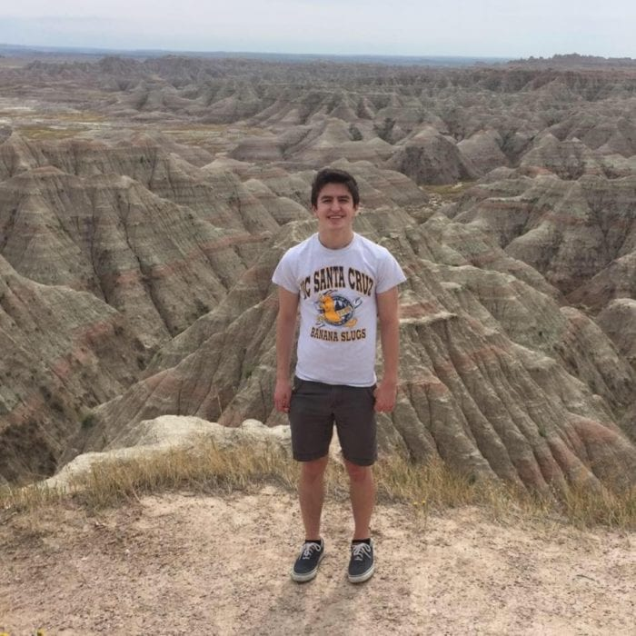

## Bryan Thornlow  
  
Ph.D. Candidate    
bthornlo@ucsc.edu  
[Website](https://users.soe.ucsc.edu/~bpt26/)  
[CV](https://users.soe.ucsc.edu/~bpt26/thornlow_CV.pdf)  
[Google Scholar](https://scholar.google.com/citations?user=-mjgRsgAAAAJ&hl=en&oi=ao)  
**Research Interests**: evolutionary genetics, tRNA genetics, phylogenetics, data science  
**Brief Bio**: Bryan is a graduate student at UCSC, focusing on the evolution of tRNAs and their flanking regions. Prior to coming to UCSC, he studied biology at Cornell University, specializing in animal physiology.  

