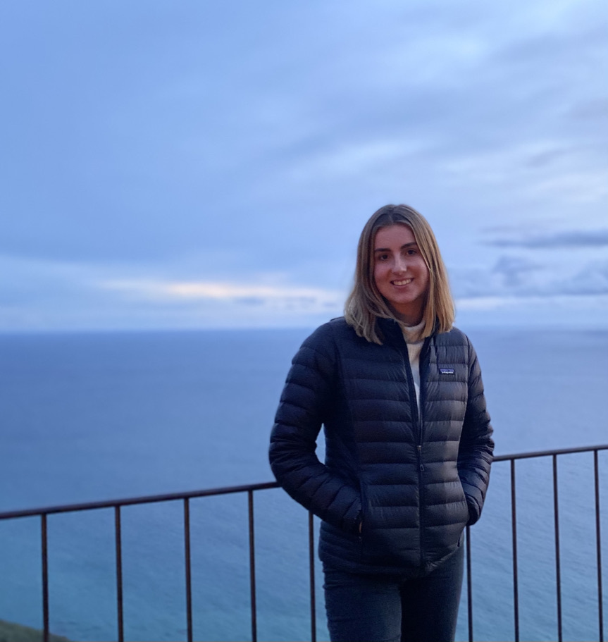

## Mara Baylis

Assistant Specialist, mbaylis@ucsc.edu  
Research Interests: Somatic mutation in mitochondria and genomes and stuff
Present: Mara is now a graduate student in CompBio at UC Berkeley. 

