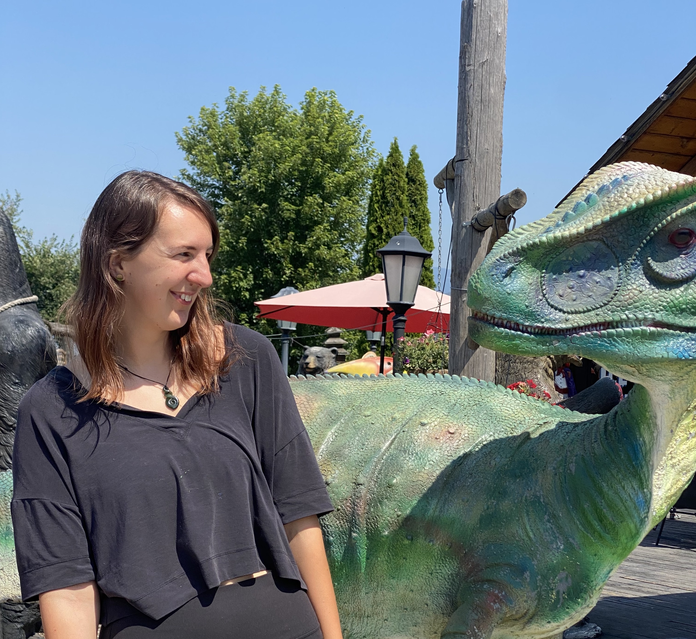

# Bianca De Sanctis

Postdoc, bdesanct@ucsc.edu  
Into population genetics, molecular evolution, ancient environmental DNA. Previously a PhD student at Cambridge with Richard Durbin, Eske Willerslev and John Welch. 

