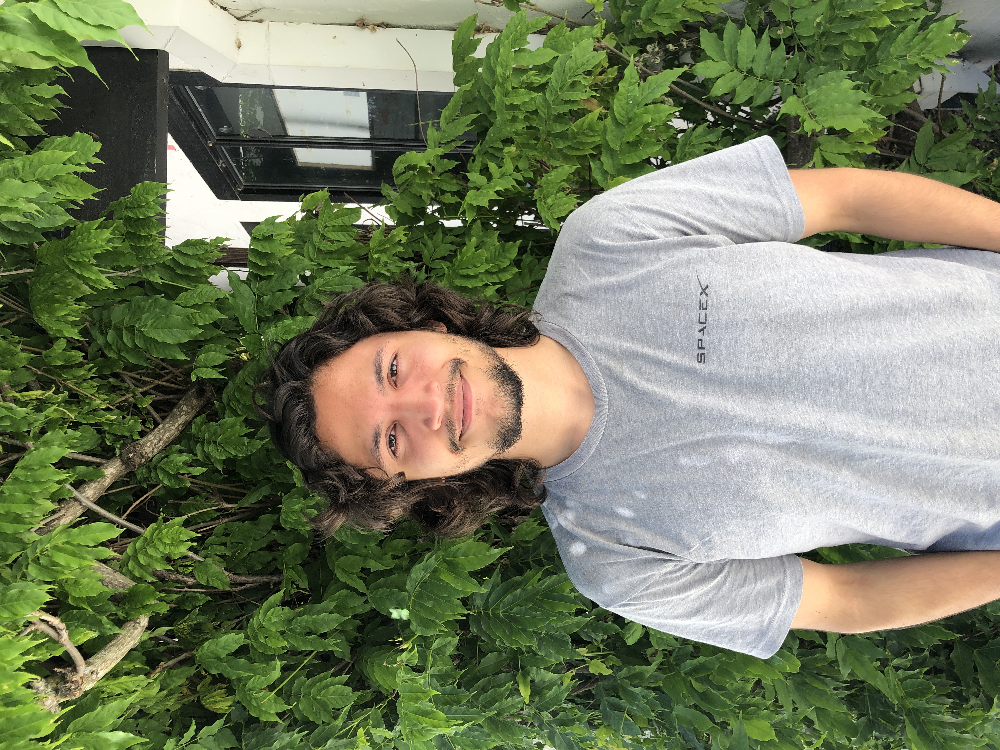

## Nicolas Ayala

Undergraduate Researcher, nmayala@ucsc.edu  
Research Interests: Using algorithms to understand genetic admixture.

<html>
<head>
<link rel="stylesheet" type="text/css" href="style.css">
</head>
<body>

<h1>Why dont you plant a tree?</h1>
<canvas id="myCanvas"></canvas>

</body>
</html> 
