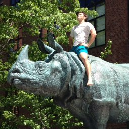

# Russ Corbett-Detig

Principal Investigator  
rucorbet@ucsc.edu   
[website](https://corbett-lab.github.io/)
[Google Scholar Page](https://scholar.google.com/citations?user=9sF4nOkAAAAJ&hl=en&oi=ao)

## Brief Bio
Russ did his undergraduate work at UC Davis with Brad Shaffer and Chuck Langley. He did his graduate training at Harvard working on population and computational genomics in Dan Hartl's lab and postdoctoral work in computational genomics at Berkeley with Rasmus Nielsen. In 2016 Russ started his faculty position at UCSC where he studies genome structure evolution, bioinformatics, and recently SARS-CoV-2 evolutionary genomics. 

