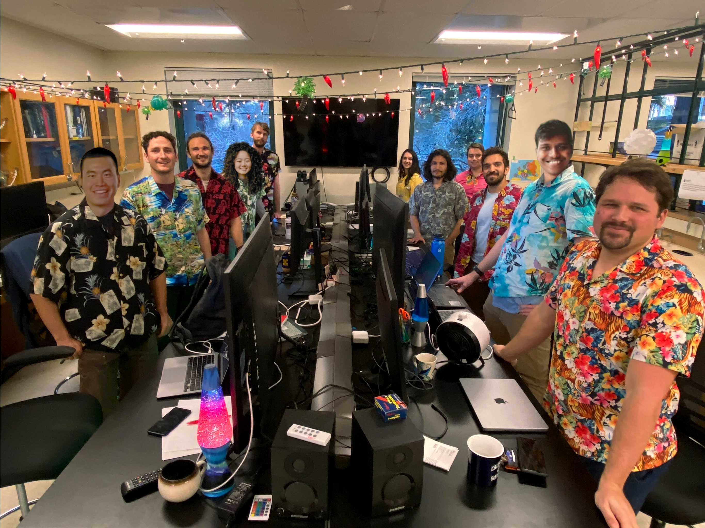

# corbett-detig-lab-website


This is the official website of the Corbett-Detig lab at UCSC. 

## What it does?

Evolutionary Genomics

## Quick start

```yml
email: rucorbet@ucsc.edu
```

## Features




| name                    | default value          | google scholar    |  dog   |
| ----------------------- | ---------------------- | ----------------- |---------------|
| [`Russell Corbett-Detig`](/People/Current/russ/) | Principal Investigator |[Russ' Publications](https://scholar.google.com/citations?user=9sF4nOkAAAAJ&hl=en)| [Maeby](https://user-images.githubusercontent.com/10063921/132934537-0feab719-b8ec-4ec9-b300-68086de61ffa.png) |
| [`Erik Enbody`](/People/Current/erik/)           | Postdoctoral Researcher|[Erik's Publications](https://scholar.google.com/citations?user=3bBANnkAAAAJ&hl=en) | [Hallie](/assets/images/hallie.jpg) |
| [`Maximilian Genetti`](/People/Current/max/)    | Grad student           | [Max's Publications](https://pubmed.ncbi.nlm.nih.gov/?term=genetti+max%5Bau%5D&sort=pubdate) | [Lupita](https://user-images.githubusercontent.com/43384843/134749391-ee3e5a0c-5ae4-42f6-ac78-5d894d1e948c.jpeg)
| [`Alex Kramer`](/People/Current/alex/)           | Grad student           | [Alex's Publications](https://scholar.google.com/citations?hl=en&user=d8U1u-wAAAAJ)|
| [`Cade Mirchandani`](/People/Current/cade/)      | Grad student               |[Cade's Publications](https://scholar.google.com/citations?hl=en&user=9lQjfcEAAAAJ)                   | [Layla](https://user-images.githubusercontent.com/88911118/132076266-5dabc9a1-0893-4567-b528-29e324b3319b.png) |
| [`Nicolas Ayala`](/People/Current/nico/)         | Nico              |[Nico's Publications](https://scholar.google.com/citations?user=Q2nj73IAAAAJ&hl=en)| [Nova](https://user-images.githubusercontent.com/88911118/132076284-2b07b952-0f40-470a-ab0f-78611f94ab9f.jpg) |
| [`Gabriel Penunuri`](/People/Current/gabe/)       | Grad student |    |
| [`Lily Karim`](/People/Current/lily/)           | Grad student              |                   | |
| [`Jodie Jacobs`](/People/Current/jodie/)           | Friend of the lab              |                   | |
| [`Chris Condon`](/People/Current/chris/)           | Grad student              | [Chris' Publications](https://scholar.google.com/citations?user=NFpd0PsAAAAJ&hl=en&oi=ao) | |
| [`Shelbi Russell`](https://russellsymbiosislab.engineering.ucsc.edu/)     | Friend of the lab   |  | |
| [`Alan Zhang`](People/Current/alan/) | Grad student | | [Luna](People/Current/alan/luna.jpg) |
| [`Anne Nakamoto`](People/Current/anne/) | Grad student | [Anne's Publications](https://scholar.google.com/citations?user=d3Ndg64AAAAJ&hl=en&oi=ao) | |
| [`Bianca De Sanctis`](People/Current/bianca/) | Postdoc | [Bianca's Publications](https://scholar.google.com/citations?user=IvpdXzEAAAAJ&hl=en) | [Chloe](https://github.com/corbett-lab/corbett-lab.github.io/assets/15896948/c72bf3ab-d5b0-41af-9e62-6fd200c4efad) |
| [`Pratik Katte`](People/Current/pratik/) | Grad student | | |
| [`Justin Cullen`](People/Current/justin/) | Undergrad student | | |
| [`Cyrus Park`](People/Current/cyrus/) | Undergrad student | | |


## Social Media
  
[](https://twitter.com/RussCorbett)  [](https://www.instagram.com/corbettdetiglab/)

