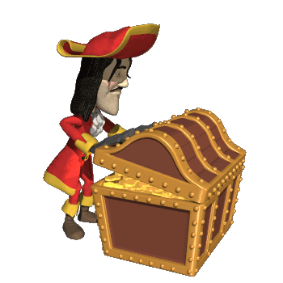
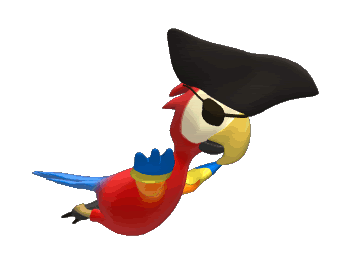
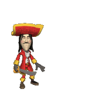
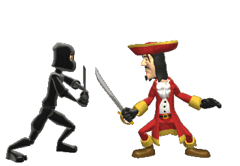
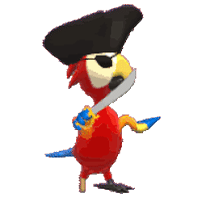
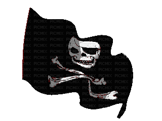
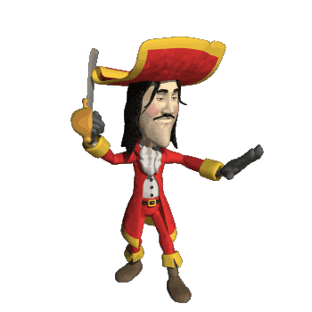
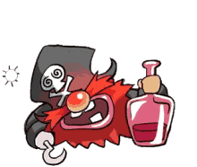
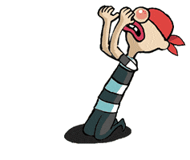

# Pirate Minigolf Scorecard

<html>
<head>
<link rel="stylesheet" type="text/css" href="style.css">

</head>
<body>

<input id="playersinput" placeholder="Number of Players" type="text"><button id="playersbutton" onclick="to_scorecard()">Enter</button>

</body>
</html>
