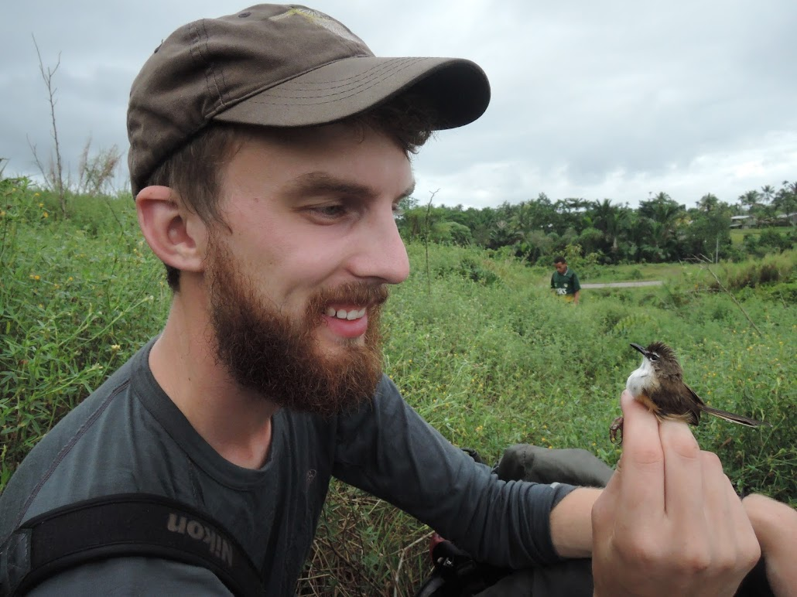

## Erik Enbody  
Postdoctoral Scholar  

eenbody@ucsc.edu   
**Research interests**: Conservation and evolutionary genomics, adaptation, and speciation    
**Brief Bio**: Erik is a postdoc at UCSC working on informatics for the California Conservation Genomics Project. Erik completed his PhD at Tulane University in evolutionary and behavioral ecology and finished his postdoctoral work on animal genomics at Uppsala University in Sweden prior to arriving at UCSC.  

