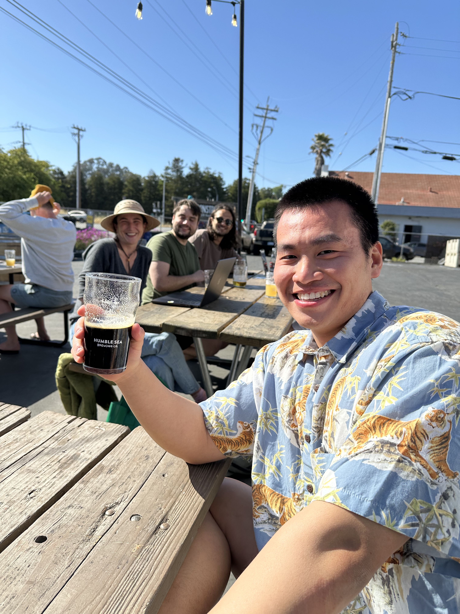
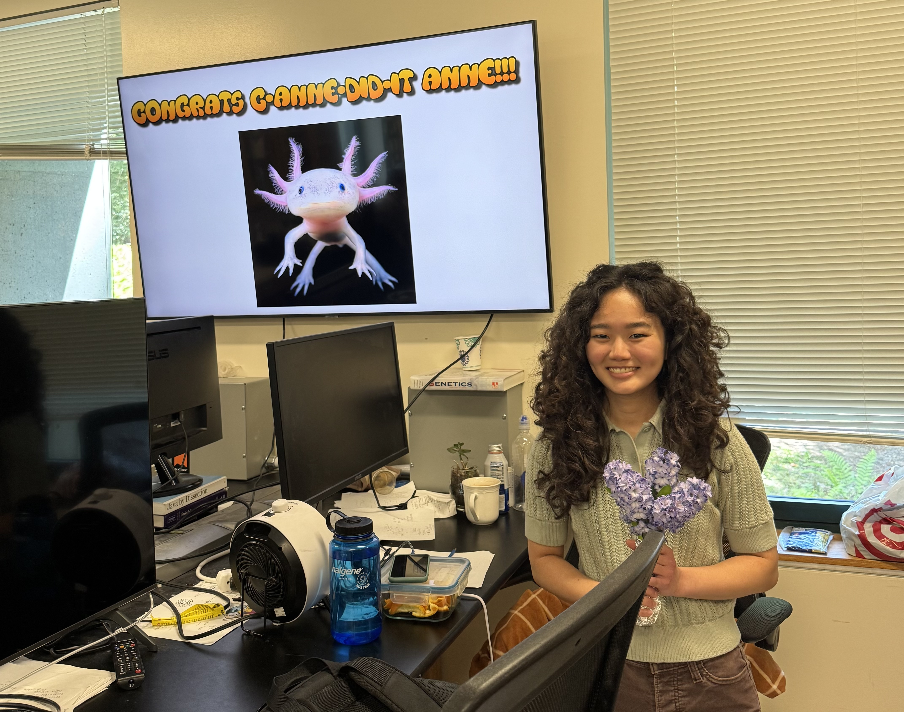
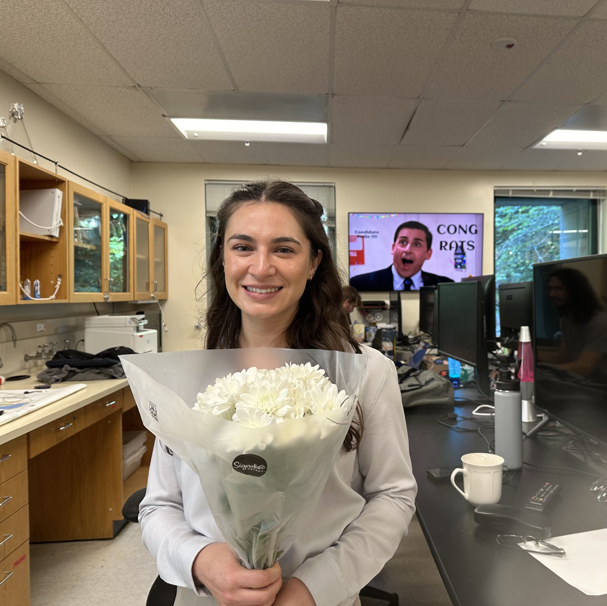
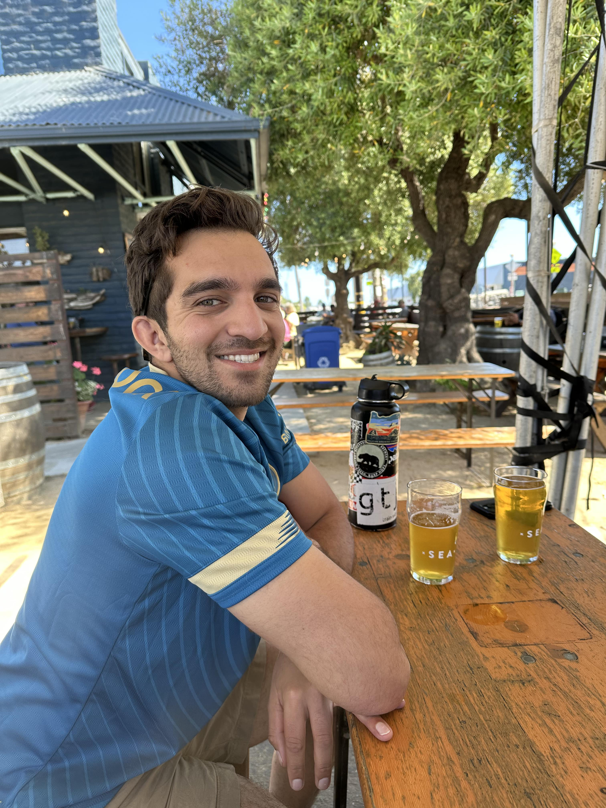
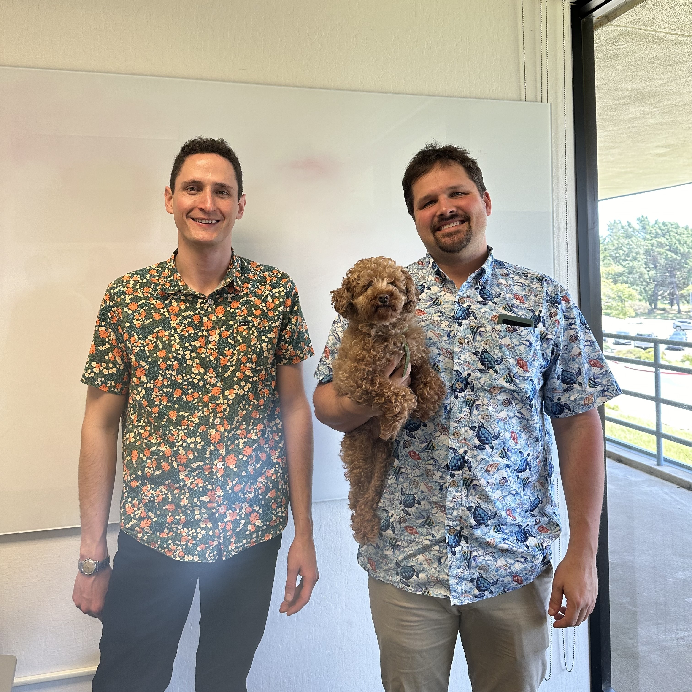

--- 
sort: 4
---

# Lab News

## [Alan Zhang](/People/Current/alan/) advances (5/27/25)

Congrats to Alan on his alan-cement to candidacy! His thesis proposes three tools in the panMAN ecosystem: panMAMA, panMANIAK, and panMAARG, which will revolutionize genome analysis at the scale of millions. He is t-alan-ted and his programs are fast as af. Amazing job, PhD c-alan-did-it!

## [Anne Nakamoto](/People/Current/anne/) advances (5/22/25)

Congrats Anne for passing her adv-anne-cement to c-anne-didacy with highest honors! Her work will use genomics for the conservation of biodiversity in California and Hawaii. Thank you Anne for conserving the genomes and saving our planet. Be sorry for future advancers who will have to live up to this standard. 

## [Camryn Morey](/People/Current/camryn/) joins the the lab (March 2025)
We're delighted to welcome Camryn to the lab! She comes to us from undergraduate work with Greg Rouse at UCSD. 

## Farewell [Erik](/People/Current/erik/)! (12/19/24)
This week we bird farewell to Erik, who has been a postoc in the lab since 2021. We could warble on about Erik’s awesome work in the lab leading bioinformatics for the California Conservation Genomics Project, but will sparrow you of all the details. We are plover-whelmed with excitement that Erik will soon be starting his tenure track position at Cornell Computational Biology, and can’t wait to see all the finch-resting work he does next. Congrats Erik, we will miss you, and wish you owl the best!

## Farewell [Nico](/People/Current/nico/)! (7/31/24)
After approximately 3.5 years with the lab, today was Nico's last day. This fall he will begin His PhD in Computational Biology at UC Berkeley. Nicolas, the timeless being, will be remembered. We wish Him the best! May He spread his gospel to His future lab and the city of Berkeley. 

## Jodie Jacobs Advances (7/1/24)
Jodie (dear friend of the lab) passed her qualifying exam wonderfully! Her work will investigate changes in cell state in infected versus uninfected *Wolbachia* cells, characterize the transcriptome of new *Wolbachia* infections, and construct a genetically tractible system for manipulation of *Wolbachia*. Congrats, *Candidatus Jodii*!

## [Cade Mirchandani](/People/Current/cade/) Advances (6/27/24)
Cade passed his qualifying exam in a totally Cade-like fashion (totally crushed it)! His work will explore the evolutionary genomics of diverse organisms, from tiny endosymbionts to species of conservation interest across California. Congrats, Ph.D Cade-did-it!

## [Maximilian Genetti](/People/Current/max/) Defended his Thesis (5/24/2024)
Max did an amazing job defending his thesis on leveraging various approaches for studying admixture in diverse natural populations. He linked Neotropical cats' hybridization with human-mediated deforestation, found signals of ancestry specific selection in Aficanized honebees, and developed tools to model multilocus selection in European sparrows. Congrats, Dr. Genetticist!

## [Anne Nakamoto](/People/Current/anne/) and [Alan Zhang](/People/Current/alan/) Join the the lab (3/22/2024)
We're delighted to welcome Anne and Alan to the lab. Anne comes to us as a GRFP fellow from UC Berkeley undergrad in Ksenia Krasileva's lab, and Alan joins from undergraduate work with Ian Korf at UC Davis. 

## [Chris Condon](/People/Current/Chris/) Advances (8/17/2023)
Chris wrecked his qualifying exam (in a good, non-confusing way). Congratulations, Chris! 

His research will use a ton of innovative genomic techniques to figure out how genetic conflicts shape popupations and molecules.

## [Gabe Penunuri](/People/Current/Gabe/) Advances (7/13/2023)
Gabe nailed his qualifying exam. His work producing tools to facilitate the detection of protein mimics will take the symbiosis world by storm.

## [Lily Karim](/People/Current/Lily/) Advances (7/7/2023)
Lily passed her qualifying exam with flying colors --- like a glorious autumn wind. Her thesis proposal was rad. Lily's work will enable public health offices to mitigate the spread of major pathogens.

## [Jakob McBroome](/People/Alumni/Jakob/) Defended his Thesis (5/26/2023)
Jakob's thesis work is amazing. He built tools to study pathogen genomes, and invented new ways the we will track the evolution adn emergence of epidemiologically novel strains of major pathogens. Congratulations, Jakob! 

## Bryan Thornlow Defended his Thesis (10/25/2021)
One of the two first graduate student to join our lab, Bryan, defended his thesis! Bryan showcased amazing work on tRNA evolution and predicting tRNA activity. Next, he's head to Boston to work as a data scientist at [Rome Therapeutics](https://rometx.com/). Congratulations, Bryan! We're super excited to see what's next for you.  

   

  
  
## ShUShER is out in JOSS! (10/18/2021)
Alex Kramer's first first author paper just came out in the Journal of Open Source Software. [Check it out!](https://joss.theoj.org/papers/10.21105/joss.03677) In it, Alex developed a port of the UShER phylogenetic placement approach for webAssembly in order to preserve privacy of SARS-CoV-2 genome sequence data. [Check out the web portal](https://shusher.gi.ucsc.edu/). Many thanks to the NextStrain treat, whose auspice tree viewer and sequence alignment we used. 

## Cluster Tracker is live! (10/1/2021)
We sent [cluster tracker](https://clustertracker.gi.ucsc.edu) into the world today! Cluster tracker is a tool for exploring the geographic spread of SARS-CoV-2 across the US. Our [twitter thread](https://twitter.com/RussCorbett/status/1443983255040978949) explains the tool and provides information about its usage.   

  

## We have a new website (9/11/2021)
Welcome to the newly redesigned Corbett-Detig lab website! Take a look around. Maybe [figure out what filetype you are](https://corbett-lab.github.io/what_file_type/)? [Go meet the dogs](https://corbett-lab.github.io/the%20doggies%20(&%20others)/), or [the people](https://corbett-lab.github.io/People/). 
